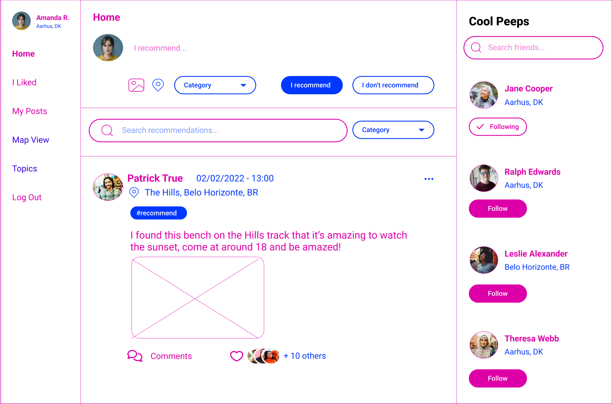
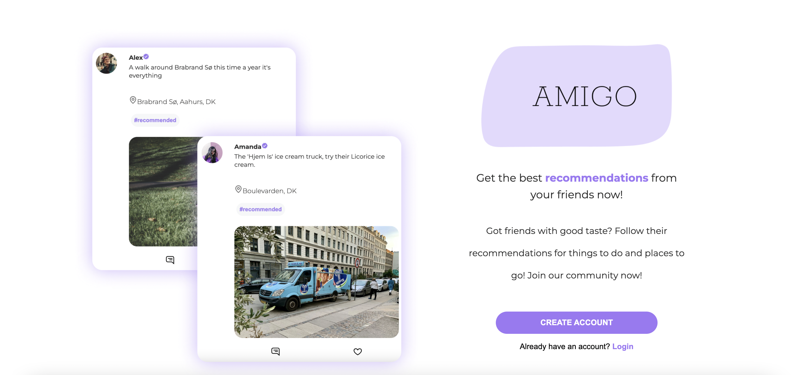
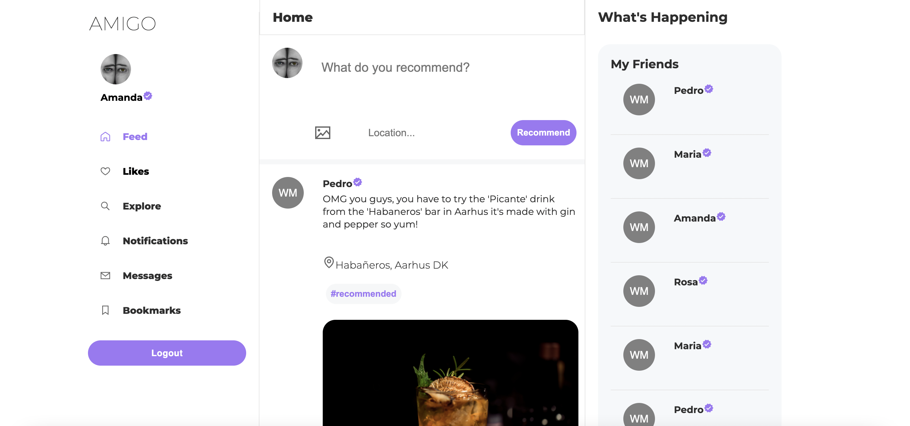
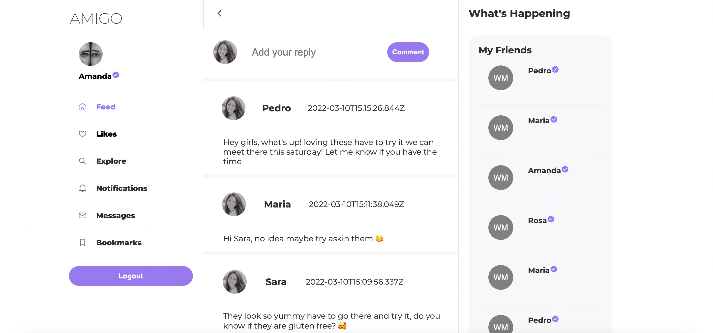

# AMIGO CLIENT #

### Project Description 📑

AMIGO is a social media platform for recommendations, where users can recommend experiences,  products or places to their friends. Much like twitter, people can create recommendations and comment on each other's posts. 

### Wireframes 👾
[INTERACTIVE WIREFRAME](https://www.figma.com/proto/Cxdpp4MHzQQU0j66WFE529/Final-Project?page-id=0%3A1&node-id=150%3A6&viewport=241%2C48%2C0.07&scaling=contain&starting-point-node-id=18%3A195&show-proto-sidebar=1/ "AMIGO's interactive wireframe")

Example of the Home Page as wireframe:

### Technologies Used 💻 
#### Frontend 👀
* React JS
* Jsx, CSS , JS
* Grommet
* MUI
#### Backend 🧠
* Mongoose, MongoDB Atlas
* Node JS 
* Express JS

#### Deployment 🙌
* Heroku
* Netlify

#### Highlighted Packages ✨
* react-twitter-embed
* react-modal

### Pages & Components 🧚🏼‍♀️
#### Pages
* Home Navigation
* Signup
* Login
* Profile
* Recommendation List
* Recommendation Details
* Edit Recommendation

#### Components
* Home Page
* IsAnon
* IsPrivate
* Navbar
* Navbar Option
* Add Recommendation
* Recommendation Card
* User Card
* Widgets
* Add Comment
* Comment Card

### Screenshots 📸

### Project Links 💫

[AMIGO's SERVER REPO](https://github.com/AmandaCiliberto/amigo-server/ "AMIGO's SERVER REPO")

[AMIGO's CLIENT REPO](https://github.com/AmandaCiliberto/amigo-client/ "AMIGO's CLIENT REPO")

[TRY AMIGO HERE](https://monamigo.netlify.app/ "TRY AMIGO HERE")

### Future Work 🥸
* Likes on posts
* Edit profile page
* Follow and have followers
* Search for friends
* Accept image type Webp
* Make icons change color on navbar on hover 
* Have profile image
* Implement google places autocomplete
* much more...

### About Me 👩

My name is Amanda Rodrigues, I'm a Digital Product Designer shifting to fullstack web development based in Denmark. This project has been developed by me in connection with the Ironhack Full Stack Web Development bootcamp. 
